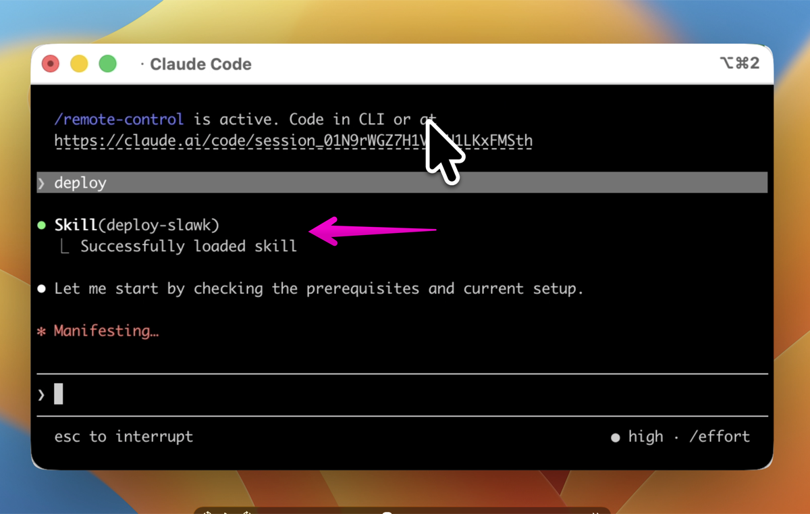

  

  An open-source Slack clone built in 14 days with Claude Code. 
  Slack charges $8/user/month. A 50-person org pays $5,000/year. 
  This is the experiment: can any startup self-build and host an alternative for $100/year total?

  <b>Stack:</b> Node.js · PostgreSQL · Prisma · Socket.io · React · Vite · Tailwind 
  <b>Features:</b> Channels · Threads · Voice calls · File uploads · Search · Admin panel · Mobile responsive 
  <b>Vision:</b> minimalist · familiar · fast · safe · open-source

## [Day 13](https://www.linkedin.com/posts/nathancavaglione_day-1314-cloning-slack-with-claude-code-activity-7437474978582716417-23R_?utm_source=share&utm_medium=member_desktop&rcm=ACoAABo_DiMBthZ8gqvy6PiOdSHUMuPt9XgMnfY)

## [Day 12](https://www.linkedin.com/posts/nathancavaglione_day-1214-cloning-slack-with-claude-code-activity-7437209559691259905-qKE-?utm_source=share&utm_medium=member_desktop&rcm=ACoAABo_DiMBthZ8gqvy6PiOdSHUMuPt9XgMnfY)

## [Day 11](https://www.linkedin.com/posts/nathancavaglione_day-1114-cloning-slack-with-claude-code-activity-7436864574370369536-ph9P?utm_source=share&utm_medium=member_desktop&rcm=ACoAABo_DiMBthZ8gqvy6PiOdSHUMuPt9XgMnfY)

## [Day 10](https://www.linkedin.com/posts/nathancavaglione_day-1014-cloning-slack-with-claude-code-activity-7436479309319475200-W8uQ?utm_source=share&utm_medium=member_desktop&rcm=ACoAABo_DiMBthZ8gqvy6PiOdSHUMuPt9XgMnfY)

## [Day 8+9](https://www.linkedin.com/posts/nathancavaglione_day-914-cloning-slack-with-claude-code-activity-7436051734357221376-p5Qu?utm_source=share&utm_medium=member_desktop&rcm=ACoAABo_DiMBthZ8gqvy6PiOdSHUMuPt9XgMnfY)

## [Day 7](https://www.linkedin.com/posts/nathancavaglione_day-714-cloning-slack-with-claude-code-ugcPost-7435417548227100674-VZR3?utm_source=share&utm_medium=member_desktop&rcm=ACoAABo_DiMBthZ8gqvy6PiOdSHUMuPt9XgMnfY)

## [Day 6](https://www.linkedin.com/posts/nathancavaglione_day-614-cloning-slack-with-claude-code-activity-7435032144223281153-t1T0?utm_source=share&utm_medium=member_desktop&rcm=ACoAABo_DiMBthZ8gqvy6PiOdSHUMuPt9XgMnfY)

## [Day 5](https://www.linkedin.com/posts/nathancavaglione_day-514-cloning-slack-with-claude-code-share-7434705951200272385-wOGI?utm_source=share&utm_medium=member_desktop&rcm=ACoAABo_DiMBthZ8gqvy6PiOdSHUMuPt9XgMnfY)

## [Day 4](https://www.linkedin.com/posts/nathancavaglione_day-414-cloning-slack-with-claude-code-activity-7434330782736928768-1L7h?utm_source=share&utm_medium=member_desktop&rcm=ACoAABo_DiMBthZ8gqvy6PiOdSHUMuPt9XgMnfY)

## [Day 3](https://www.linkedin.com/posts/nathancavaglione_day-314-cloning-slack-with-claude-code-share-7433958640103026689-hdKo?utm_source=share&utm_medium=member_desktop&rcm=ACoAABo_DiMBthZ8gqvy6PiOdSHUMuPt9XgMnfY)

## [Day 2](https://www.linkedin.com/posts/nathancavaglione_day-214-cloning-slack-with-claude-code-activity-7433486444993613824-umUt?utm_source=share&utm_medium=member_desktop&rcm=ACoAABo_DiMBthZ8gqvy6PiOdSHUMuPt9XgMnfY)

## [Day 1](https://www.linkedin.com/posts/nathancavaglione_slack-charges-8usermonth-for-a-50-person-activity-7433209073036210176-JcWL?utm_source=share&utm_medium=member_desktop&rcm=ACoAABo_DiMBthZ8gqvy6PiOdSHUMuPt9XgMnfY)

